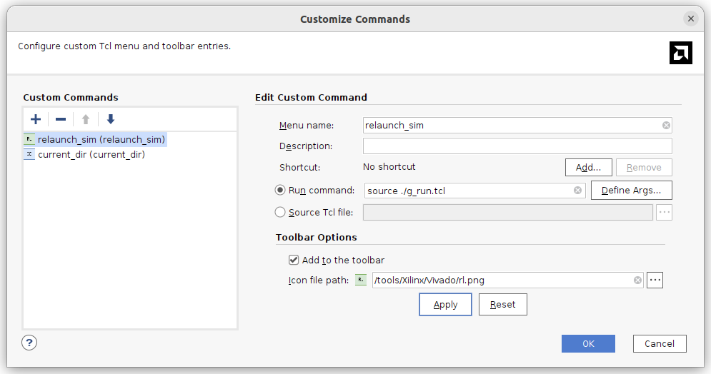
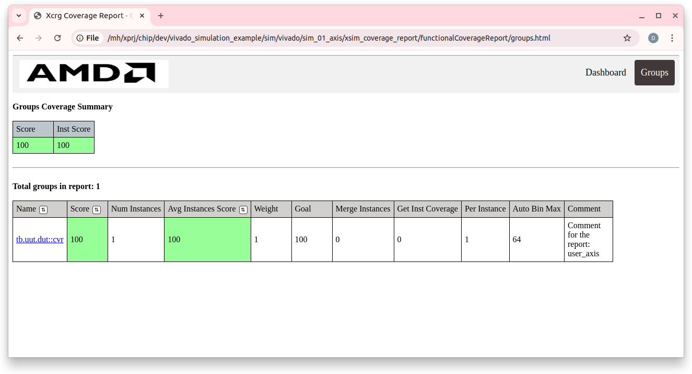
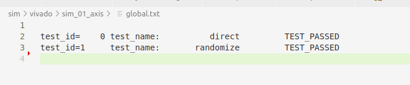

# vivado_simulation_example

This project demonstrates the ability to model projects in the SystemVerilog language using the Vivado system.

Features:
* Organization of directories for working with the Visual Studio Code 
* Several separate projects for modeling
* Modeling in command line mode and in GUI mode
* Separate scripts for compilation, elaborate, running tests and code coverage
* Ability to work with other simulators

Examples are taken from the DigitalDesignSchool repository:
https://github.com/DigitalDesignSchool/ce2020labs/tree/master/next_step/dsmv

## Examples 

| __Name__ | __Description__ 
| ------      | ----
| [tb_01](doc/tb_01.md)     | simple example
| [tb_02](doc/tb_02.md)     | add virtual interface


## Preparing Visual Studio Code

Install Visual Studio Code and TerosHDL and surfer extensions

* TerosHDL: https://marketplace.visualstudio.com/items?itemName=teros-technology.teroshdl
* surfer: https://marketplace.visualstudio.com/items?itemName=surfer-project.surfer

## Preparing Vivado

* Install Vivado
* Copy the rl.png and cd.png files from the doc directory to the /tools/Xilinx/Vivado/ directory
* Install a custom relaunch_sim command
    * Run Vivado
    * Select the menu item "Tools/Custom_Commands/Custom_Commands..."
    * Click on "+" (Add command) and fill in the data for the command
        * Menu name: relaunch_sim
        * Run command: "source ./g_run.tcl"
        * "Add to tollbar" - selected
        * "Icon file path:" - "/tools/Xilinx/Vivado/rl.png
        
* Install a custom current_dir command (you won't need it for the simulation, but it's very useful)
    * Run Vivado
    * Select the menu item "Tools/Custom_Commands/Custom_Commands..."
    * Click on "+" (Add command) and fill in the data for the command
        * Menu name: relaunch_sim
        * Run command: "cd [get_property directory [current_project]]"
        * "Add to tollbar" - selected
        * "Icon file path:" - "/tools/Xilinx/Vivado/cd.png
        
* Specify the correct path to the selected Vivado version in the sim/vivado/env.sh file

## Directory structure

| __Directory__             | __Description__
| ---                       | ---
|                           |
| doc                       | Documentation
| src                       | Example source code
| tb                        | Test source code
|                           |
| sim/vivado                | Vivado simulation
| sim/vivado/sim_01_axis    | Simulation of axis example
| src/axis                  | Axis example source code
| tb/tb_01_axis             | Axis test source code
|                           |

Test code is separated from example code.

## Working with the project

### Preparation

* Open the built-in Visual Studio Code terminal in the example directory sim/vivado/sim_01_axis
    * You can open it using the context menu for the directory
* Run the command source ../env.sh
    * Setting the path for the selected version of Vivado can be done in other ways, for example, you can specify it in the file ~/.bashrc
    * You can add a call "source ../env.sh" to each of the .sh files

    ### Files in the sim_01_axis directory

| __File__              | __Description__
| ---                   | ---
|                       |
| compile.sh            | Compile source code
| elaborate.sh          | Build the program for simulation
| c_run_0.sh            | Run the test with the test_id=0 parameter in command line mode
| c_run_1.sh            | Run the test with the test_id=1 parameter in command line mode
| cvr.sh                | Generate a code coverage report
| all.sh                | Run all tests in command line mode
| g_run.sh              | Run the GUI, uses g_run.tcl
| g_run.tcl             | Run the test in GUI mode, set the test_id parameter and timing diagram files
| systemverilog.f       | List of files to compile
| top.wcfg              | Timing diagram for the top level
| uut.wcfg              | Timing diagram for the component
| dump.vcd              | Timing diagram for viewing via GTKWave or sufer
| global.txt            | Generalized test execution result


### Development and compilation

Development of the project is associated with the creation and editing of the source texts of the project, for this we use the Visual Studio Code editor. It is necessary to determine the composition of the files that are included in this test and write them to the systemverilog.f file; If the project contains files in the VHDL language, then they must be specified in the vhdl.f file and the compile.sh file must be adjusted

During the development process, you can compile and build the example at any time.

* compile.sh - compile the example
* eleborate.sh - build the example

Compilation is performed quite quickly, Vivado compiles only modified files.
Building the example for large projects is a lengthy process, it should be launched only after the compilation is carried out without errors.

After successfully building the example, you can proceed to the modeling session.

### Running simulation in command line mode

The top level of simulation is the tb component, it has a test_id parameter that specifies the test number. For example, tb/tb_01_axis has two tests and two command files for running tests

| __Number__    | __Run file__  | __Name__  | __Description__
| ---           | ---           | ---       | ---
| 0             | c_run_0.sh    | direct    | Direct indication of test actions
| 1             | c_run_1.sh    | randomize | Random test actions

To run in the built-in terminal, enter the command ./c_run_0.sh or ./c_run_1.sh; The test result will be displayed in the console. A line with the final result will be added to global.txt and a dump.vcd file with timing diagrams will be generated. It can be viewed directly in Visual Studio Code with the sufer plugin installed or using the GTKWave program.

### Viewing the code coverage report

The ./cvr.sh file starts generating the Code Coverage report for the last executed test.

The report is generated in the sim/vivado/sim_01_axis/xsim_coverage_report/functionalCoverageReport/ directory

You need to open this directory in Visual Studio Code, through the context menu "Open Containing Folder" and there select viewing the dashboard.html file in the browser


Example dashboard:


Example groups


### Group launch in command line mode

The all.sh file launches all actions with tests in command line mode:
* source code compilation
* example build
* running tests c_run_0 and c_run_1
* generating code coverage report
* displaying the generalized result

The general result of all tests is in the global.txt file.

An example of the global.txt file when all tests are successfully executed:


When adding new tests, you need to adjust all.sh

Group launch allows you to make sure that changes in one part of the project do not affect the functionality in another part of the project. This is especially important for large projects.

### Working in GUI mode

Debugging HDL code is very difficult without timing diagrams. Viewing timing diagrams via GTKWave and surfer helps but does not completely solve the problem.

The g_run.tcl file contains the launch parameters:
````
close_sim
xsim tb_behav -testplusarg test_id=1 -view ./top.wcfg -view uut.wcfg
````
* test_id=1 - the number of the test to be launched, passed as a parameter to the tb component
* -view <name>.cfg - the name of the file with the timing diagram, there may be several

Work order:
* Specify the test number in the g_run.tcl file
* Run the command "./g_run.sh &" in the terminal

    * note: the & symbol after the command is very important, the terminal will remain available for executing commands
    * the vivado system will be launched and windows with the specified timing diagrams will be opened
* We conduct one or more simulation sessions
    * you can use all the features of vivado, for example, step-by-step debugging
    * you can open new windows with timing diagrams

As a rule, as a result of debugging you will need to change source text. This can be done by running the compile.sh, elaborate.sh commands in the terminal again and restarting the simulation session. Typically, the compile.sh and elaborate.sh commands can be called by pressing the "up arrow" key in the terminal window.

To restart the simulation session, go to the Vivado window and select the relaunch_sim command, which was added when Vivado was prepared. The command is available in the "Tools/Custom_Commands/relaunch_sim" menu or as an icon in the Toolbar line. When restarting, the g_run.tcl file will be called again. All windows will be closed and the windows specified in g_run.tcl will be opened again; Before restarting, you can change g_run.tcl by specifying a new test_id and new time diagram files there. The relaunch_sim command will not be executed if any of the windows with time diagrams has unsaved information.

The Vivado console also displays text output, and you can also call the code coverage report via the cvr.sh file

View of the Vivado window with the result of the randomize test simulation.


## Conclusion

The presented modeling path allows you to quickly detect errors in the source code at the stage of compilation or assembly of the project. Allows you to run the same tests in the command line mode or in the GUI mode. Allows you to make a group launch of tests.

A similar modeling path for the Icarus and Questa simulators is presented in the project:
https://github.com/dsmv/2023-lalambda-fpga-labs/tree/main/lab_day3_02_schoolrisc