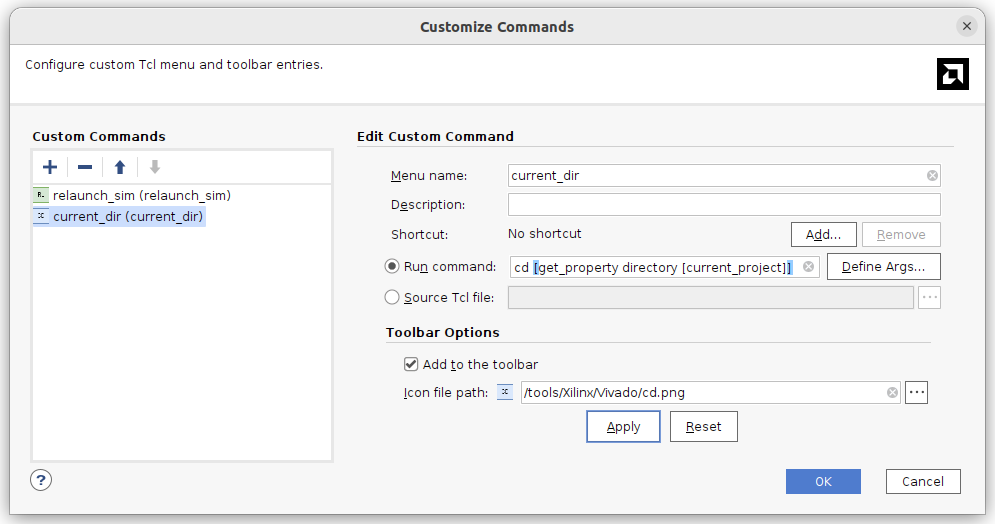
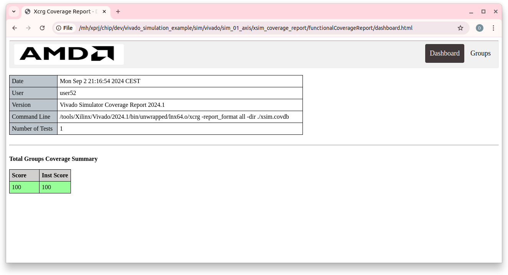
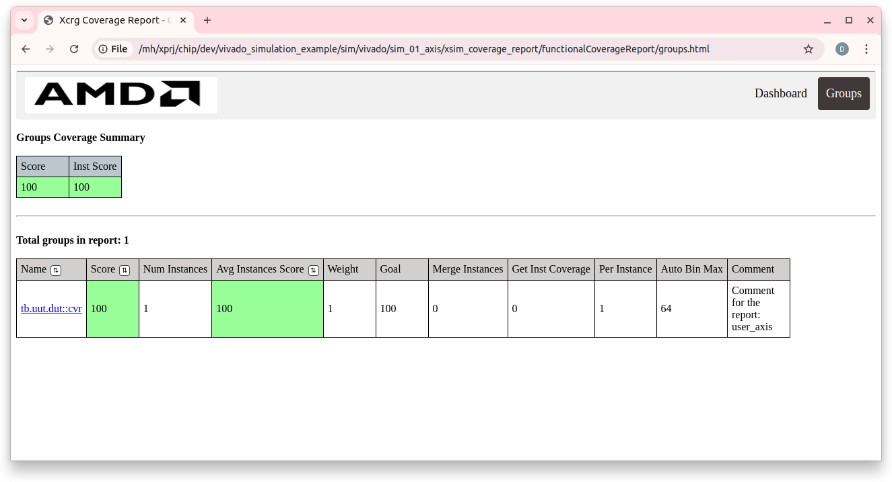
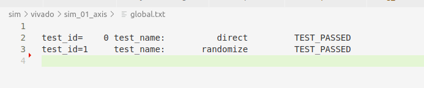
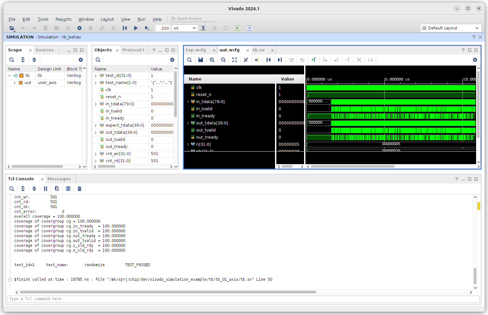

# vivado_simulation_example

Этот проект показывает возможность моделирования проектов на языке SystemVerilog с использованием системы Vivado.

Особенности:
* Организация каталогов для работы с системой Visual Studio Code
* Несколько отдельных проектов для моделировния
* Моделирование в режиме командной строки и в режиме GUI
* Отдельные скрипты для компиляции, сборки, запуска тестов и code coverage
* Возможность подключения других симуляторов

Примеры взяты репозитория DigitalDesignSchool: https://github.com/DigitalDesignSchool/ce2020labs/tree/master/next_step/dsmv

## Подготовка Visual Studio Code

Установите Visul Studio Code и расширения TerosHDL и surfer

* TerosHDL: https://marketplace.visualstudio.com/items?itemName=teros-technology.teroshdl
* surfer: https://marketplace.visualstudio.com/items?itemName=surfer-project.surfer

## Подготовка Vivado

* Установите Vivado 
* Скопируйте файлы rl.png и cd.png из каталога doc в каталог /tools/Xilinx/Vivado/
* Установите собственную команду relaunch_sim
    * Запустите Vivado
    * Выберете пункт меню "Tools/Custom_Commands/Custom_Commands..."
    * Нажмите на "+" (команда Add) и заполните данные для команды
        * Menu name: relaunch_sim
        * Run command: "source ./g_run.tcl"
        * "Add to tollbar" - выбрано
        * "Icon file path:" - "/tools/Xilinx/Vivado/rl.png
        

* Установите собственную команду current_dir (она не понадобиться при симуляции но очень полезная)
    * Запустите Vivado
    * Выберете пункт меню "Tools/Custom_Commands/Custom_Commands..."
    * Нажмите на "+" (команда Add) и заполните данные для команды
        * Menu name: relaunch_sim
        * Run command: "cd [get_property directory [current_project]]"
        * "Add to tollbar" - выбрано
        * "Icon file path:" - "/tools/Xilinx/Vivado/cd.png
        
* Указать в файле sim/vivado/env.sh корректный путь к выбранной версии Vivado

## Структура каталогов

| __Каталог__               | __Описание__  
| ---                       | ---
|                           |               
| doc                       |   Документация
| src                       |   Исходный код примеров
| tb                        |   Исходный код тестов             
|                           |               
| sim/vivado                |   Моделирование в системе Vivado  
| sim/vivado/sim_01_axis    |   Моделирование примера axis
| src/axis                  |   Исходный код примера axis
| tb/tb_01_axis             |   Исходный код теста axis
|                           |

Код теста отделён от код примера.

## Работа с проектом

### Подготовка

* Открыть встроенный терминал Visual Studio Code в каталоге примера sim/vivado/sim_01_axis
    * Открыть можно с помощью контекстного меню для каталога
* Выполнить команду source ../env.sh
    * Настройка пути для выбранной версии Vivado может выполняться и другими способами, например возможно указать в файле ~/.bashrc
    * Возможно внесение вызова "source ../env.sh" в каждый из .sh файлов 

### Файлы в каталоге sim_01_axis

| __Файл__                  | __Описание__  
| ---                       | ---
|                           |               
|  compile.sh               |  Компиляция исходных текстов
|  elaborate.sh             |  Сборка программы для моделирования               
|  c_run_0.sh               |  Запуск теста с параметром test_id=0 в режиме командной строки             
|  c_run_1.sh               |  Запуск теста с параметром test_id=1 в режиме командной строки             
|  cvr.sh                   |  Формирование отчёта по code coverage             
|  all.sh                   |  Запуск всех тестов в режиме командной строки             
|  g_run.sh                 |  Запуск GUI, использует g_run.tcl             
|  g_run.tcl                |  Запуск теста в режиме GUI, задание параметра test_id и файлов временных диаграмм
|  systemverilog.f          |  Список файлов для компиляции
|  top.wcfg                 |  Временная диаграмма для верхнего уровня 
|  uut.wcfg                 |  Временная диаграмма для компонента
|  dump.vcd                 |  Временная диаграмма для просмотра через GTKWave или sufer
|  global.txt               |  Обобщённый результат выполнения тестов


### Разработка и компиляция

Разработка проекта связана с созданием и редактированием исходных текстов проекта, для это используем редактор Visual Studio Code. Необходимо определить состав файлов которые входят в данный тест и записать их в файл systemverilog.f; Если в проекте есть файлы на языке VHDL то надо их указать в файле vhdl.f и скорректировать файл compile.sh

В процессе разработки можно в любой момент провести компиляцию и сборку примера. 
* compile.sh - компиляция примера
* eleborate.sh - сборка примера

Компиляция выполняется достаточно быстро, Vivado проводит компиляцию только изменённых файлов.
Сборка примера для больших проектов является длительным процессом, её надо запускать только после того как компиляция будет проводится без ошибок.

После успешной сборки примера можно переходить к сеансу моделирования.

### Запуск моделирования в режиме командной строки

Верхним уровнем моделирования является компонент tb, он имеет параметр test_id который определяет номер теста. Для примера tb/tb_01_axis cуществует два теста и два командных файла для запуска тестов


| __Номер__ | __Файл запуска__  | __Название__      | __Описание__  
| ---       | ---               | ---               | ---
| 0         |   c_run_0.sh      |   direct          | Прямое указание тестовых воздействий
| 1         |   c_run_1.sh      |   randomize       | Случайные тестовые воздействия

Для запуска во встроенном терминале вводим команду ./c_run_0.sh или ./c_run_1.sh; Результат теста отобразится в консоле. Строчка с окончательным результатом будет добавлена в global.txt и будет сфомрирован файл dump.vcd с временными диаграммами. Его можно посмотреть непосредственно в Visual Studio Code при установленном плагине sufer или с использованием программы GTKWave.

### Просмотр отчёта code coverage

Файл ./cvr.sh запускает формирование отчёта Code Coverage для последнего выполненного теста. 
Отчёт формируется в каталоге sim/vivado/sim_01_axis/xsim_coverage_report/functionalCoverageReport/

Надо открыть этот каталог в Visual Studio Code, через контекстное меню "Open Containing Folder"  и там выбрать просмотр файла dashboard.html в браузере


Пример dashboard:


Пример groups


### Групповой запуск в режиме командной строки

Файл all.sh запускает все действия с тестами в режиме командной строки:
* компиляция исходнгого кода
* сборка примера
* запуск тестов c_run_0 и c_run_1
* формирования отчёта code coverage
* отображение обобщённого результата

Общий результат выполнения всех тестов находится в файле global.txt.

Пример файла global.txt при успешном выполнении всех тестов:


При добавлении новых тестов необходимо скорректировать all.sh

Групповой запуск позволяет убедиться что изменения в одной части проекта не затронули функциональность в другой части проекта. Это особенно актуально для больших проектов.

### Работа в режиме GUI

Отладку HDL кода очень трудно проводить без временных диаграмм. Просмотр временных диаграмм через GTKWave и surfer помогает но не решает полностью проблему.

Файл g_run.tcl содержит параметры запуска:
````
close_sim
xsim tb_behav -testplusarg test_id=1  -view ./top.wcfg  -view uut.wcfg
````
* test_id=1  - номер запускаемого теста, передаётся как параметр в компонент tb
* -view <name>.cfg  - имя файла с временной диаграммой, может быть несколько

Порядок работы:
* Задать в файле g_run.tcl номер теста
* В терминале выполнить команду "./g_run.sh &"  
    * примечание: символ & после команды очень важен, терминал останется достпуным для выполнения команд
    * будет запущена система vivado и открыты окна с указанными временными диаграмми
* Проводим один или несколько сеансов моделирования
    * можно использовать все возможности vivado, например пошаговую отладку
    * можно открывать новые окна с временными  диаграммами

Как правило, в результате отладки понадобится изменять исходный текст. Это можно делать, в терминале надо будет снова выполнить команды compile.sh, elaborate.sh и перезапустить сеанс моделирования. Как правило, команды compile.sh и elaborate.sh можно вызвать нажав на клавишу "стрелка вверх" в окне терминала.

Для перезапуска сеанса моделирования надо перейти в окно Vivado и выбрать команду relaunch_sim, которая была добавлена при подготовке Vivado. Команда доступна в меню "Tools/Custom_Commands/relaunch_sim" или виде иконки в строке Toolbar. При перезапуске снова будет вызван файл g_run.tcl. Все окна будут закрыты и снова будут открыты окна которые указаны в g_run.tcl; Перед перезапуском можно изменить g_run.tcl указав там новый test_id и новые файлы временных диаграмм. Команда relaunch_sim не будет выполнена если какое-нибуть из окон с временными диаграмми будет иметь несохранённую информацию.

В консоли Vivado также отображается текстовый вывод, также можно вызвать формирование отчёта code coverage через файл cvr.sh

Вид окна Vivado с результатом моделирования теста randomize.



## Заключение

Представленный путь моделирования позволяет оперативно обнаруживать ошибки в исходном коде на этапе компиляции или сборки проекта. Позволяет одни и теже тесты запускать в режиме командной строки или в режиме GUI. Позволяет сделать групповой запуск тестов.

Аналогичный путь моделирования для симуляторов Icarus и Questa представлен в проекте: https://github.com/dsmv/2023-lalambda-fpga-labs/tree/main/lab_day3_02_schoolrisc
