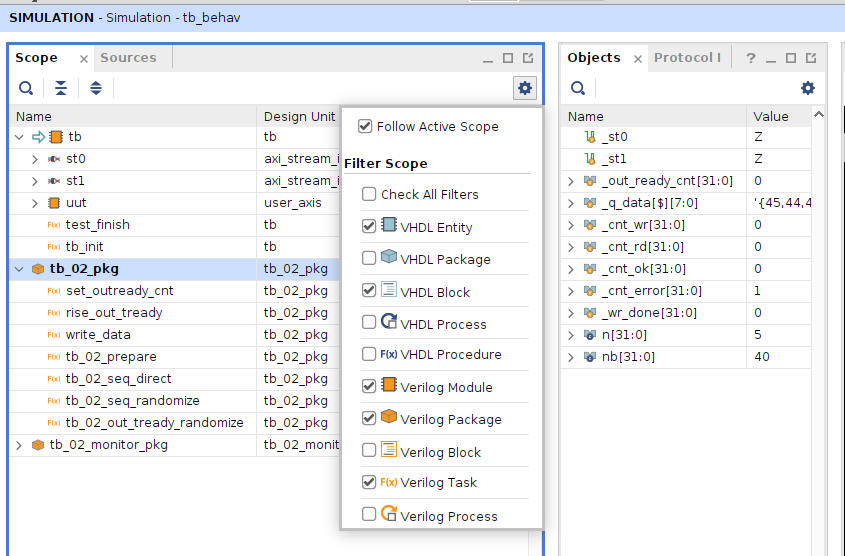

# tb_02 - использование виртуальных интерфейсов

Пример tb_02_vif имеет ту же самую функциональность что и пример tb_01_axis но исходный код теста разделён на несколько файлов:

* tb.sv - верхний уровень теста
* bind_user_axis.sv - используется то же самый файл что и в примере tb_01_axis
* tb_common/if/axi_stream_if.sv - объявление интерфейса 
* tb_02_pkg.sv - основные процедуры тестирования
* tb_02_monitor_pkg.sv - процедура tb_02_monitor

Основой примера является применение интерфейсов SystemVerilog для подключения к портам проверяемого компонента и применение виртуальных интерфейсов SystemVerilog для взаимодействия с процедурами в пакетах SystemVerilog.

В компоненте tb объявляются два интерфейса:

````
//  Unit under test

axi_stream_if   #( .bytes ( n ) )  st0( clk );
axi_stream_if   #( .bytes ( n ) )  st1( clk );
````

В пакете tb_02_pkg объявляется константа 'n' и виртуальные интерфейсы:

````
    localparam  n = 5, nb = n * 8;

    virtual     axi_stream_if   #( .bytes ( n ) )  _st0;
    virtual     axi_stream_if   #( .bytes ( n ) )  _st1;
````

В процедуре tb_init производится присваивание интерфейсов st0, st1 к виртуальным интерфейсам _st0, _st1:

````
    _st0 = st0;
    _st1 = st1;
````
С этого момента сигналами интерфейсов можно управлять из всех процедур пакета tb_02_pkg и изо всех мест которые проведут импорт пакета tb_02_pkg.

В данном примере функциональность формирования тестовых воздействий перенесена в пакет tb_02_pkg а функциональность мониторинга перенесена в отдельный пакет tb_02_monitor_pkg. 

Обратите внимание, что при таком решениии важен порядок компиляции который задаётся в файле sim02_vif/systemverilog.f; Файл tb_02_pkg.sv должен быть скомпилирован раньше чем tb_02_monitor.sv

## Настройка симулятора Vivado

По умолчанию симулятор Vivado не отображает пакеты SystemVerilog поэтому внутренние сигналы пакетов скрыты. Требуется включить отображение пакетов.



## Недостатки tb_02_if

В данном примере используется интерфейс axis_stream_if который предназначен для моделирования шины AXI Stream и имеет собственные процедуры write() и read() однако эти процедуры не используются в тесте. Это сделано для точного переноса примера из tb_01_axis.

## Возможности по улучшению

Компонент user_axis имеет две шины AXI Stream которые объявлены как отдельные сигналы. Возможна переработка компонента при которой интерфейсы SystemVerilog будут использованы непосредственно в описании портов компонента. 